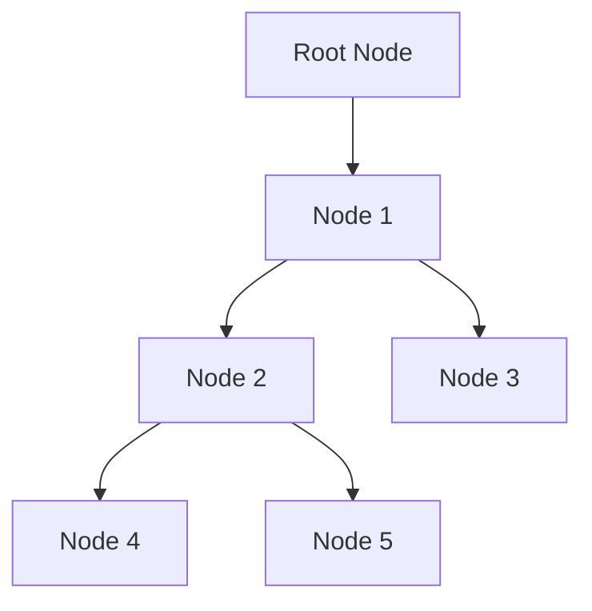

Selamat datang di Godot Initiative Indonesia! Pada kesempatan kali ini, kami akan membahas potensi luar biasa dari Godot Engine sebagai platform pengembangan game yang populer dan inovatif. Mari kita jelajahi bersama berbagai fitur dan keunggulan Godot Engine serta bagaimana pengembang game di Indonesia dapat memanfaatkannya.

## Mengapa Godot Engine?

Godot Engine telah menjadi pilihan favorit bagi pengembang game di seluruh dunia, termasuk Indonesia. Berikut adalah beberapa alasan mengapa Godot Engine patut dipertimbangkan:

1. **Gratis dan Open-source**: Godot Engine sepenuhnya gratis dan open-source, sehingga dapat diakses oleh siapa saja tanpa biaya lisensi. Ini memberikan akses lebih luas bagi pengembang game di Indonesia untuk menciptakan game mereka tanpa hambatan finansial.

2. **Multiplatform**: Godot Engine mendukung berbagai platform, termasuk Windows, macOS, Linux, Android, iOS, dan platform lainnya. Ini memungkinkan pengembang game di Indonesia untuk menghasilkan game yang dapat dijalankan di berbagai perangkat, mencapai audiens yang lebih besar.

3. **Bahasa Pemrograman GDScript**: Godot Engine menggunakan GDScript sebagai bahasa pemrograman utama. GDScript adalah bahasa yang mudah dipelajari dan powerful, mirip dengan Python. Dengan GDScript, pengembang game di Indonesia dapat membuat logika game dengan cepat dan efisien.

4. **Editor yang Powerful**: Godot Engine dilengkapi dengan editor yang intuitif dan powerful. Editor ini menyediakan alat visual yang memudahkan pengembang game untuk merancang, mengatur, dan mengedit game mereka. Fitur seperti tampilan scene, animasi, dan pengaturan sumber daya dapat diakses dengan mudah.

## Mengenal Fitur Utama Godot Engine

Mari kita jelajahi beberapa fitur utama yang membuat Godot Engine menjadi pilihan yang powerful untuk pengembangan game di Indonesia:

### Node-based Scene System

Godot Engine menggunakan sistem node-based yang powerful untuk mengatur elemen-elemen dalam game. Setiap objek dalam game diwakili sebagai "node" yang dapat dihubungkan satu sama lain. Ini memungkinkan pengembang game untuk membuat hierarki objek yang kompleks dengan mudah, mengatur interaksi antara objek, dan mengatur logika game secara visual.

Berikut adalah contoh penggunaan node-based scene system dalam Godot Engine:



Dalam contoh ini, Node 1 adalah node utama yang menjadi induk dari Node 2 dan Node 3. Node 2 juga menjadi induk dari Node 4 dan Node 5. Dengan menggunakan node-based scene system, pengembang game dapat dengan mudah mengatur hierarki objek dan mengatur interaksi antara mereka.

### Pengaturan Animasi

Godot Engine menyediakan alat pengaturan animasi yang powerful. Dengan menggunakan al

at ini, pengembang game dapat membuat animasi kompleks, termasuk perpindahan, perputaran, dan perubahan skala objek. Pengaturan animasi memungkinkan pengembang game untuk membuat game yang hidup dan menarik dengan mudah.

Berikut adalah contoh kode GDScript untuk mengatur animasi pergerakan karakter:

```gd
# Memulai animasi pergerakan karakter
func start_movement_animation():
    $AnimatedSprite.play("walk")

# Menghentikan animasi pergerakan karakter
func stop_movement_animation():
    $AnimatedSprite.stop()
    $AnimatedSprite.frame = 0
```

Dalam contoh ini, kita menggunakan `AnimatedSprite` node untuk mengontrol animasi pergerakan karakter. Saat karakter bergerak, animasi "walk" akan diputar. Ketika karakter berhenti, animasi akan berhenti dan frame animasi akan diatur kembali ke 0.

### Fisika Terintegrasi

Godot Engine memiliki sistem fisika terintegrasi yang powerful. Ini memungkinkan pengembang game untuk menerapkan hukum fisika pada objek dalam game. Pengembang game dapat mengatur gaya, gravitasi, tumbukan, dan interaksi fisik lainnya dengan mudah.

Berikut adalah contoh kode GDScript untuk menerapkan gaya pada objek:

```gd
# Menerapkan gaya pada objek
func apply_force():
    var force = Vector2(100, 0)
    $RigidBody2D.apply_central_impulse(force)
```

Dalam contoh ini, kita menggunakan `RigidBody2D` node untuk menerapkan gaya pada objek. Gaya diterapkan dalam arah horizontal dengan menggunakan `apply_central_impulse`.

## Mengeksplorasi Potensi Godot Engine Lebih Lanjut

Godot Engine menawarkan lebih banyak fitur dan alat yang dapat membantu pengembang game di Indonesia menciptakan game yang menarik dan inovatif. Dalam artikel ini, kami hanya menyentuh beberapa aspek penting dari Godot Engine.

Kami mendorong Anda untuk menjelajahi dokumentasi resmi Godot Engine di [situs web Godot](https://godotengine.org) untuk mempelajari lebih lanjut tentang fitur-fitur Godot Engine dan memanfaatkannya dalam pengembangan game Anda. Selamat mencoba dan semoga sukses dalam petualangan pengembangan game Anda dengan Godot Engine!